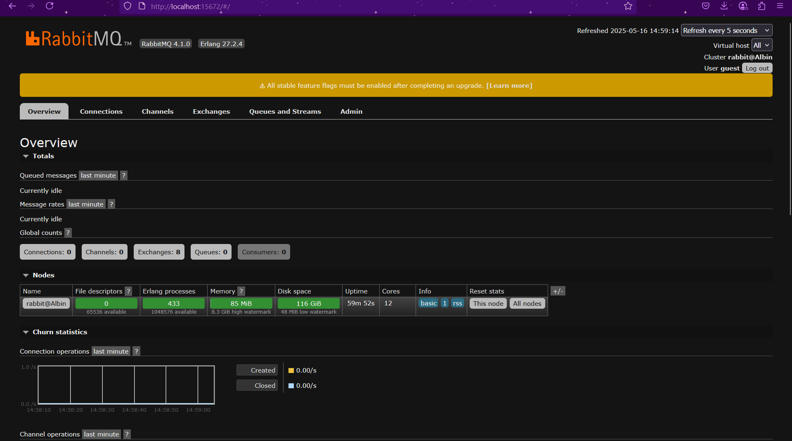
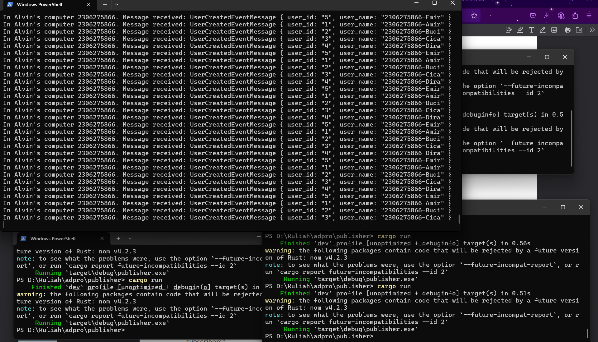

 
a. What is AMQP?

AMQP (Advanced Message Queuing Protocol) adalah protokol komunikasi standar terbuka yang dirancang untuk layanan perpesanan aplikasi. Protokol ini memungkinkan aplikasi-aplikasi untuk berkomunikasi satu sama lain melalui broker pesan yang mendukung AMQP, terlepas dari bahasa pemrograman atau platform yang digunakan. AMQP biasa digunakan dalam sistem seperti RabbitMQ untuk pengiriman pesan yang andal dan terukur.

 
 
b. Apa arti dari guest:guest@localhost:5672?

String koneksi "guest:guest@localhost:5672" memiliki beberapa komponen:

- **guest** pertama: Username yang digunakan untuk autentikasi ke server AMQP
- **guest** kedua: Password untuk username tersebut
- **localhost:5672**: Alamat server AMQP dimana:
  - **localhost** adalah nama host server (dalam hal ini mengacu pada komputer lokal)
  - **5672** adalah nomor port standar yang digunakan oleh layanan AMQP
  
Dengan kata lain, string tersebut adalah URL koneksi yang digunakan untuk menghubungkan aplikasi ke server RabbitMQ yang berjalan pada komputer lokal, menggunakan kredensial default (username "guest" dan password "guest").

### Screenshot

Berikut screenshot dari RabbitMQ dan tiga console yang menjalankan bersamaan

Dalam eksperimen ini, kami menjalankan tiga konsol subscriber secara bersamaan, masing-masing mengakses queue yang sama. Hal ini memungkinkan pemrosesan pesan menjadi lebih cepat karena beban pemrosesan dibagi di antara tiga konsumen. Sebelumnya, dengan hanya satu subscriber, antrian pesan meningkat pesat, namun dengan menambahkan lebih banyak subscriber, antrian pesan berkurang lebih cepat. Selain itu juga menunjukkan horizontal scaling dimana saat satu instance sedang memproses user 1 dan user 2, sedangkan instance lain memproses user 3 dan user 4.

Untuk pengembangan ke depan, sistem dapat ditingkatkan dengan meningkatkan kapasitas penskalaan, khususnya melalui implementasi arsitektur yang mendukung distribusi beban kerja yang lebih efisien. Hal ini mencakup optimalisasi mekanisme penerimaan pesan agar dapat menangani lebih banyak instans subscriber secara bersamaan dan menghindari bottleneck yang terjadi ketika pemrosesan terlalu bergantung pada satu instans saja. Dengan pendekatan ini, sistem akan lebih tangguh dalam menghadapi lonjakan traffic dan pertumbuhan data.